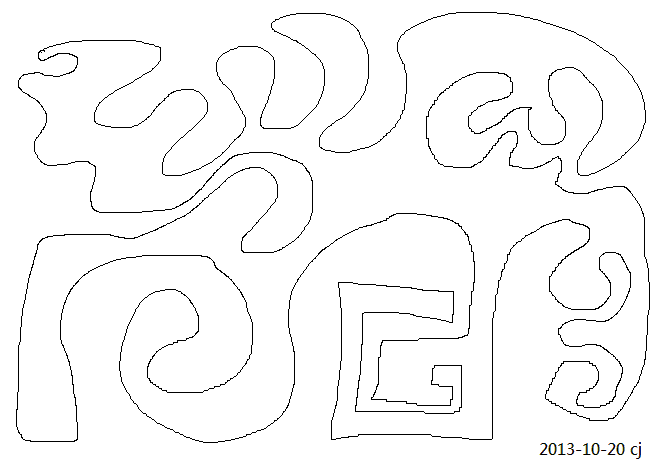
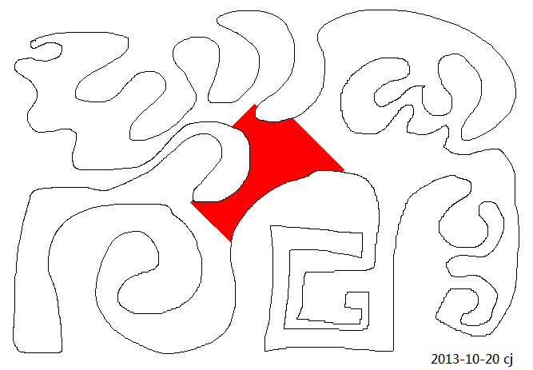
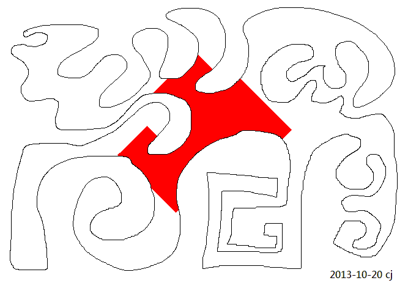
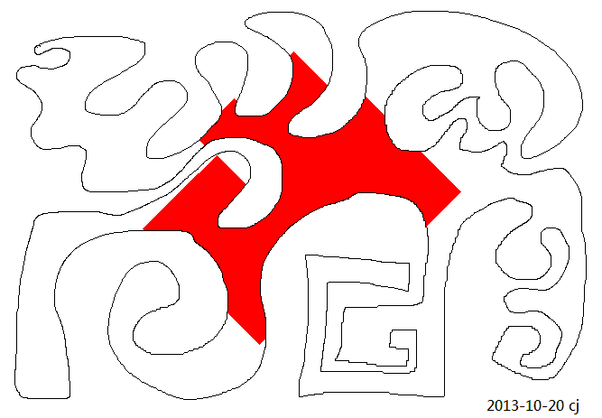
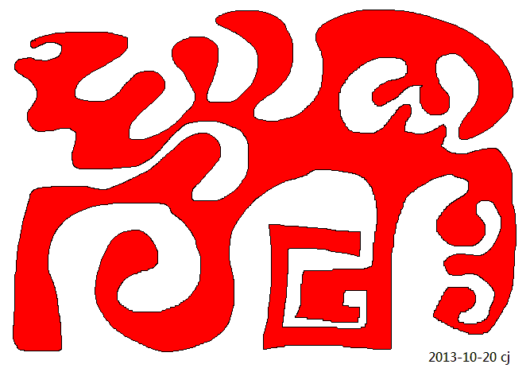

Title: Flood fill 
Date: 2013-10-22 10:20
Modified: 2013-10-22 19:30
Category: programming 
Tags: 
Slug: Flood fill
Authors: 
Summary: 看见someone提到Flood fill algorithm, 惭愧，不熟悉这个名字，于是Google一下，竟然跟BFS很像，于是想着要简单实现一下。
 

FloodFill simple implementation                        
----

Oct. 22, 2013 看见someone提到Flood fill algorithm, 惭愧，不熟悉这个名字，于是Google一下，竟然跟BFS很像，于是想着要简单实现一下。一直拖，拖到了昨晚, Sunday, Nov. 4, 才弄出个结果。           

下面这图是在Windows > Paint软件中画的，一个奇怪的形状，假如用Paint软件中的fill工具可以把这个奇怪的形状填满某一种颜色。那假如手工实现，怎么搞呢?                 
            

下面是结果，分别是填了10000次，20000次...的结果。

            
             
            
     

从程序的结果来看，在一定次数之后就填满了整个奇怪的形状。如上面的结果中，从10000次到20000次扩展的区域是否跟从20000到30000次拓展的区域一样大呢，跟什么有关？(After some steps, the shape will be filled. From the result images aboved, the extended red region added during from 10000 to 20000 is the same as the region added during from 20000 to 30000? what is the reason behind that.)                    

New functions learned:            
std::stoi
std::to_string                       

Source code: https://github.com/renc/FloodFill         