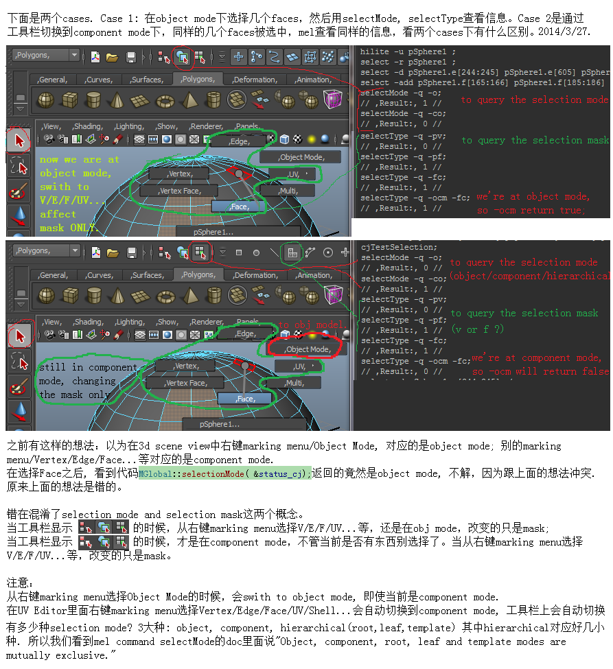
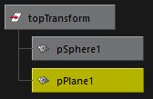
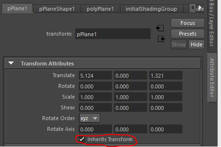
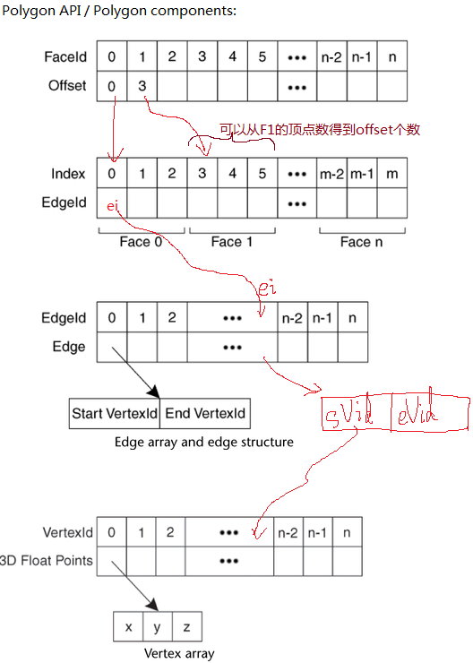

Title: Maya Programming Node
Date: 2014-04-01 10:20
Modified: 2014-09-18 23:30
Category: programming 
Tags: Maya, Mel, Python, 
Slug: Maya programming node
Authors: 

学maya时候有些新概念要记录一下，否则忘得快. 

先在一个新场景里面拖一个多边形球polygon sphere出来,      

打开Outline窗口, 看到一个pShere1, 选择Display/Shapes, 又看到pShere1下面还有一个pSphereShape1. 而在hypergraph: connection 窗口看到一共四个东西, 其中两个就是上面的pSphere1 and pSphereShape1, 而且其中三个是有连接关系的。从左到右它们分别是:      
+ polySphere1: 控制参数, 例如半径radius, axis/height上的布线密度等;    
+ pSphereShape1: 这个就是实际的shape node, 形状.                    
+ initialShadingGroup: 用于画这个球的.                 
+ pSphere1: transform node, 决定了球在空间位置.                 
```                          
import maya.cmds; 

maya.cmds.polySphere()                  # 用script建一个球 
# Result: [u'pSphere2', u'polySphere2'] # 返回就是transform node, shape node. interesting part is the result is an array [].                                        

print( maya.cmds.help('polySphere') )   # 查阅命令细节        
# related commands: polyCube, polyPlane, polyCone, polyCylinder, polyTorus.     
```    

Selection 
----  
  
起码区分清楚了selection mode and mask之后, 才能继续. 

```   
// modified from Complete Maya Programming, chapter 3.3.    
string $ns[] = `ls -sl`;    
for ($n in $ns)     
{    
    string $nt = `objectType $n`;     
    print ("Node: " + $n + ", " + $nt + "\n");      
};      
```     
ls -sl  # to list objects /components are selected.  
ls -hilite  # to list the objects ready be select their components  
ls -psh  # the current pre-select highlight coomponent.  
check the hilite command too.  
这几个东西很相像的. -sl是已经选中的东西, 例如绿色的顶点和物体. -hilite是可能在上面选择component的物体. -psh好像就是预选, 例如切换到vtx模式, 在物体上面移动鼠标, 那些被高亮的红色顶点。

    //Store old selection mode and mask 
    fPreviousSelectionMode = MGlobal::selectionMode(); 
    if( fPreviousSelectionMode == MGlobal::kSelectComponentMode ) 
        fPreviousSelectionMask = MGlobal::componentSelectionMask(); 
    else 
        fPreviousSelectionMask = MGlobal::objectSelectionMask(); 
    
    MGlobal::setSelectionMode( MGlobal::kSelectComponentMode ); 
    MGlobal::setComponentSelectionMask( MSelectionMask::kSelectMeshUVs ); 

例如我们选择一个平面模型, drag to create a plane, 得到的除了一个shape node以外, 还有一个transform node作为parent.  
    
左边应该是一连串表示shape的构造过程, 最右边是transform node.  

```  
// modified from Complete Maya Programming, ch 3.4 Hierarchies 

// to create a new transform node, and connect the sphere and plane as children 
group -name topTransform pSphere1; 
parent pPlane1 topTransform;

listRelatives topTransform;
// Result: pSphere1 pPlane1 //   
listRelatives -allDescendents topTransform;
// Result: pSphereShape1 pSphere1 pPlaneShape1 pPlane1 // 

listRelatives -parent pPlaneShape1;
// Result: pPlane1 // 
listRelatives -parent pPlane1;
// Result: topTransform // 
```   
这图很清晰表示它们的上下结构. 在这个结构下, 
```  
move -relative 0 3 0 topTransform; 
```   
很有意思地, 两个模型同时往上移动了3. 理由当然是因为下面的transform 继承了上面parent的transform. 而这种继承是可以打破的,  
试试鼠标在ui上点击这选项, mel的输出是:    
```  
setAttr "pPlane1.inheritsTransform" 0; 
setAttr "pPlane1.inheritsTransform" 1;  
```    
对应地mel命令, 执行下面的命令等于turn off this option: 
``` 
inheritTransform -off pPlane1 
``` 
 
[book, Complete Maya Programming, ch3.4 Objects]解释hierarchy and transform后就接着介绍attributes了. 
 
 
 
Polygon components  
----       
对mesh的结构肯定要了解嘛, v/e/f/uv是怎么存放的结构, 怎么访问到这些elements(v/e/f/uv, 我习惯了称为element, 而maya这边好像用component表示). 在maya doc里面描述还算清晰, 具体看:           
Developer Resources > API Guide > Polygon API > How polygons are handled internally         
这一节内容的前半段是讲mesh的components(v/e/f/uv)的结构, 后半段是讲polygon mesh作为一个shape node(相对于别的node类型)是怎么融入maya的dependency graph的。   
其中那些component的关系应该是: 下面这图是从maya doc那边截图然后按我理解来组合的,     
 

然后就是API那边有什么接口interface来获取这些信息了. API Guide > Polygon API > The five basic polygonal API classes: MItMeshPolygon, MItMeshEdge, MItMeshVertex, MItMeshFaceVertex, MFnMesh.   


Command 
---- 
定义命令cmd的语法, 例如你可能想给命令添加一些flags. [ MPxCommand::newSyntax() ]
有了语法, 在具体执行这个命令的时候, 首先当然就是分解命令, 看它是否包含了哪些参数. [doIt, parseArgs, argument list, argument data]

分regular command and interactive command (tool command)两种, 分别对应MPxCommand and MPxToolCommand. 

Context 
---- 
例如左边select tool, paint select tool, move tool...还有polygon/drag a cube等，其实每一样都是一个context，于是context好像跟tool工具是一个意思。       
mel 下 "currentCtx"询问当前context类型的object.         
grabUVContext // 调用这个context command to create an object of this context;     
// Result, grabUVContext1; // object的名字是grabUVContext1;       
setToolTo grabUVContext1; // switch from current ctx to this new context object;     

context涉及的范围很广:          
+ context command, 也就是在plugin里面注册register一个context时候，其实是一个ctx command.  上面那个grabUVContext其实是一个cmd，而且是一个特殊的cmd类型, ctx cmd; -q 也就是query下也是作为一个cmd来用. 
+ context and interactive command, 例如moveTool;          
+ context and manipulator; 例子很多.                

给attribute设置值and取值               
maya.cmds.getAttr();     
maya.cmds.setAttr();  
nodeName+'.scaleX' 这是简单的attribute;     
nodeName+'.translate' 这是所谓的compound attribute;                         
    
连接attribute   
前提是同样的type.      
     
UI   
----  
2014/7 因为要在maya界面的某个shelf上加button, 于是需要了解一下mel里面怎么建ui.        
大致是一个window, 下面是layout, 可以是各种各样的layout,  layout之间可能有父子关系，然后是button.          
当前知道的button有: 
shelfButton 就是你在界面上Polygon下面可以点击了就建模型的那种; 
toolButton 就是界面左边的select move rotate scale等.  
   
UI例子 window/tabLayout/shelfLayout/shelfButton; 用setParent .. 可以回到上一级layout.   
       
那么怎么add custom shelf or shelf button 呢?     
        
方法1. 找到maya安装路径\scripts\startup\目录, 看见下面很多shelf_xxx.mel, 例如shelf_Polygons.mel, shelf_Surfaces.mel, ...这些就是maya启动时候加载的, 也就是我们在界面上看到的.    
   
那么我们就可以尝试在这路径下添加我们自己写的shelf_yyy.mel了。       
或者是试试“MAYA_SHELF_PATH” environment variable?         

方法2.        
References: 
+ mel command document: window, tabLayout, shelfLayout, shelfButton. 


安装Plugin  
---- 
首先是要让maya找到这些plugin or script, 那这些plugin or script放哪里才能被找到呢?        
+ 可以放到maya自己指定的地方, 如maya安装目录下的相应文件夹;      
+ 可以放到你自己指定的地方, 但是需要通过某种方式告诉maya让maya来这个地方找;    
 
在当前运行的maya, script editor:             
```                            
getenv MAYA_PLUG_IN_PATH; // 注释 for c++ and python plug-ins                     
getenv MAYA_SCRIPT_PATH;  // 注释 for MEL and Python scripts    
getenv XBMLANGPATH        // 注释 for icons           
getenv MAYA_PRESET_PATH   // 注释 for maya presets          
```    
会看到当前哪些路径被考虑到了。 

假如要修改这些路径, 例如加入新的路径名字,  文档里面说有两种方法:     
+ 在系统环境变量中修改MAYA_PLUG_IN_PATH; 
+ 推荐在 
E:\Documents\maya\201X\Maya.env 这个文件中做文章, 具体请看 Maya 2014 API Guide / Installing Maya plug-ins. 
             
还有一种plugin是做成modules的方式. 其实一个目录, 里面包含了plugin的内容, 然后有一个pluginName.txt的文件, 内容是这个plugin的目录版本等信息, 把这个txt放到maya的文件夹/Ducument/maya/version/modules里面, maya的plugin manager就可以通过这个txt找到plugin, 但是还没load的.   
              
MEL command: loadPlugin, unloadPlugin, pluginInfo,    


创造Plugin  
----   
参考   
Maya 2013, Maya 2014's API Guide / Maya Python Plug-in Learning Path 教程很好.   
Maya 2015 的doc形式好像改了, 之前是User Guide 和 API Guide(或者叫API Documentation)分别不同地址, 现在2015变成一个地址下的不同子栏目了: 
+ Maya User Guide  
+ Maya Developer Help; 这个对应之前的API Guide。 

涉及maya plugin开发的时候，怎么debug呢? 

Attach to maya process ... 寄生 
----  
step 1. maya plugin manager (Window -> Settings/Preferences -> Plug-in Manager)中load your custom plugin. This plugin need to be built by the same compiler version of maya, 也许不需要. 
step 2. at your visual studio project of that custom plugin, Tools -> Attach to Process ..., choose maya.exe you will see visual studio processing some source files....这就完整寄生了. 

Debug  
----  
+ MGlobal::displayInfo(MString("..")); 输出到Script Editor. 

+ MStatus status; 这东西是很多函数的返回值，记得判断是否MS::kSuccess. 用MString MStatus::errorString() const函数方便输出函数的返回状态. 

+ 


 
```             
import sys;                     
import maya.cmds as cmds            
import maya.mel as mel               

print( sys.version ) # python version    
print ( cmds.about(apiVersion=True) ) # to print out the current version of maya    
```   


To read list:    
book: Maya Python for Games and File, Adam Mechtley, Ryan Trowbridge, 2012; http://www.maya-python.com/introduction/ 
  
vs2012 with .Net Framework v4.5, check C:\Program Files (x86)\Reference Assemblies\Microsoft\Framework\.NETFramework  
vs2012, install update 4, there is no v4.5.1 
参考 .NET Framework Versions and Dependencies http://msdn.microsoft.com/zh-cn/library/bb822049(v=vs.110).aspx   

  
