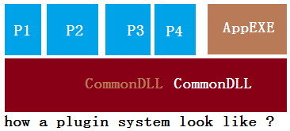

Title: How to build a plugin system 
Date: 2014-04-03 10:20
Modified: 2014-04-05 19:30
Category: programming 
Tags: 
Slug: How to build a plugin system 
Authors: 

Applications normally support custom plugins, how to do that?  
很多软件都提供了API给customer, 可以写plugin来扩展原来的程序. 

例如mudbox和maya. 从mudbox的API来看，一般可以实现
- 自定义operation, support undo and redo;
- 自定义某种brush (operation); 
- 继承实现某个类，代替原有的那个. 例如map extraction? 
当前接触到的maya api不多，知道plugin可以实现context and manipulator.

问题就来了, 一个简单的plugin system是怎么设计和实现的呢? 

case 1: 
Reference: Using Dynamic Link Libraries (DLL) to Create Plug-Ins, by Jeremiah van Oosten. 
http://3dgep.com/?p=1759 

系统包括三部分, 我们常看到的(1)在运行的.exe, (2)某个可以被加载的plugin, 还有底下可能不容易察觉的(3)被前两者所共用的，起到连接关系的dll. 三者的结构类似于: 
   
  
可见CommonDLL即被app.exe所调用，也被其它所有plugin所使用.

在实现中遇到的questions: 
- 怎么export一个dll A里面的信息到外面，让别的dll B能够使用? 
- C++编译的时候，会涉及一个managling name的问题. 这时候就要回到extern "C"

整理得到的source code: https://github.com/renc/plugins_system_example1/

case 2: 
Reference: Nuclex Plugin Architecture
更上面的CommonDLL例子结构一样，多了考虑plugin version. 

其它参考references: 
Qt plugin; 
Building an Engine Plugin System, by Niklas Frykholm, from bitsquid. http://www.altdevblogaday.com/ 

