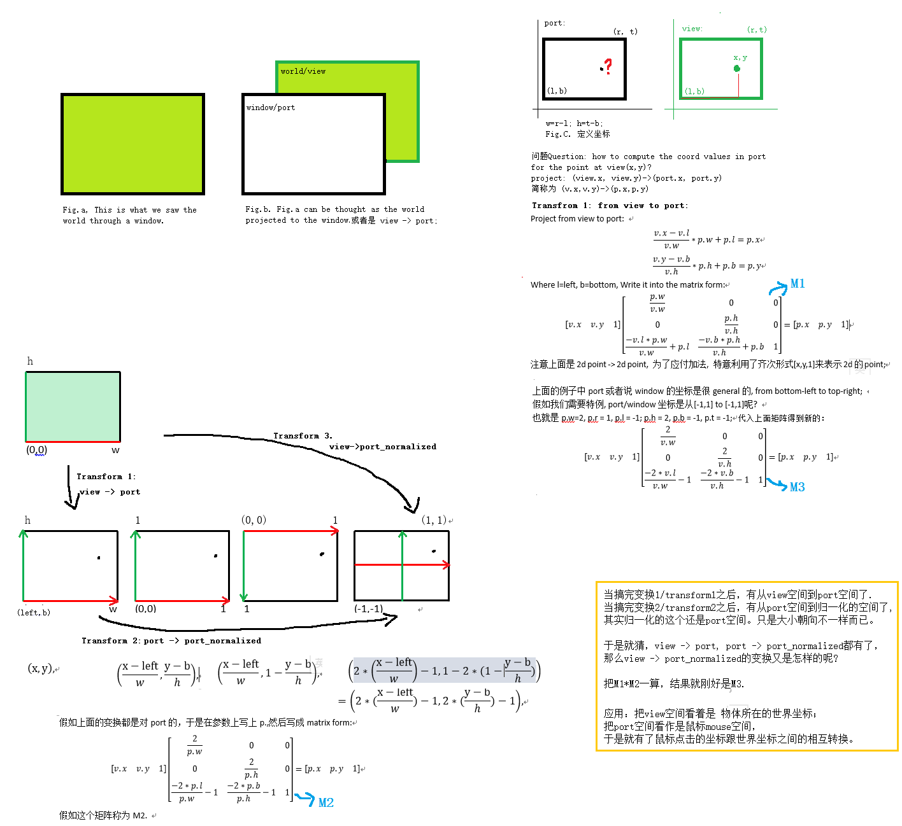

[categories] computer graphics, 

Background背景
---- 
工作中遇到一个问题, 坐标映射。A 2d world is rendering in a window, user can mouse click on the window, how to find the position at 2d world corresponding to this mouse positon?

Transform变换和映射
---- 
解法Solution直接看我自己画的图片: 

Note 1:图中的变换矩阵其实是从2d world映射到window坐标的。假如再求invert, 就可以得到逆变换, 从window坐标到2d world坐标了。推导的过程有些烦, 数学不好, 但是结果很美好:-) 
Note 2:图中例子是用横向量的, v*M=v_new; 要对应到竖向量的话请把M翻转一下.

Ortho Projection
---- 
上面只是单纯从几何来看，那原本的问题中还涉及渲染呢. 那问题就来了, 那个2d world是怎么被渲染成window窗口里面的呢? 

首先图片中的view=2d world, 是有大小和朝向的, (left, bottom) -> (right, top). width = right - left. 
好奇去看看opengl的函数，发现Ortho project也需要这几个参数, 会不会有什么联系呢?
当把图中的矩阵M3的w拆开为right, left, 又刚刚好等于ortho projection matrix( 这个矩阵在书上网上代码上都很容易找到的)。

那是不是可以把上面的Transfrom 1/2/3理解为跟OpengGL里面ortho projection类似呢? 我觉得像哦.

也就是要渲染一个2d的世界, 在模型在世界坐标排好了之后, 给出我们想要渲染出来的l/b/r/t, 通过ortho projection, 就可以把那一块区域渲染到窗口上了? 这里好像没有涉及model and camera transform喔, 也就是modelViewMatrix = identity. 

Pan and Zoom 
---- 
怎么在上一节的基础上加入pan and zoom的效果? 一般对于perspective projection来说, 会引入camera, 通过改变camera的position and target point可以实现pan平移, 移动camera来靠近和远离target point, 也达到了zoom in/out的效果. 而对于上一节中我们说到的从view to port的例子中, 貌似直接更改(left, bottom, right, top)就ok了.
例如pan: 
右移: left = left + deltaX, right = right + deltaX;
上移: bottom = bottom + deltaY, top = top + deltaY;

缩放zoom in/out就复杂一些: 

折腾一个小demo: 
 
source code:  
    
   