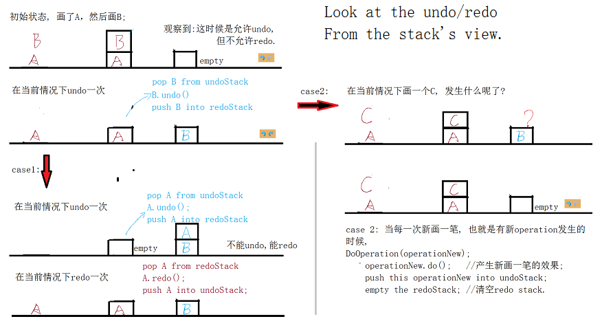
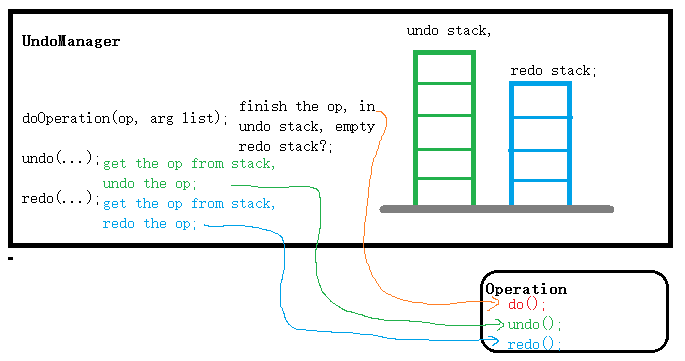

[categories] programming, 

 
> So we beat on, boats against the current, borne back ceaselessly into the past. -- The Great Gatsby
> 所以我们不停地往前划，逆流而上，回到无穷无尽的过去。《了不起的盖茨比》

一个程序假如连undo/redo都没有, 那基本上不是给人用的, 可能只能算是demo.

Undo/Redo   
---- 
用windows/paint画图工具做例子就很直观啦. 

case 1. 假如操作次序是: 画一笔A, 再画一笔B;
undo 一次就是剩下A; undo 第二次就是空;
redo 一次就是增加A; redo第二次就是恢复到A B; 
这个case的特点是undo到底了，再redo到底. 没有undo的时候又夹着redo. 

case 2. 假如操作次序是: 画一笔A, 再画一笔B;
undo 一次就是剩下A;  
区别于case1, 在剩下A之后, 下一个operation就不是undo了, 而是画一笔C. 
注意看paint画图工具里面的redo按键, 在画完C这笔之后就灰色grey了, 也等于告诉我们不能redo了, 哪之前我们undo掉的笔画B呢, B丢失了再也回不去了B了吗? 
看下面我画的图示: 

这个case2像是不错的考点哦:-) 

Merge合并     
----            
在实际实现的时候, 有时候对一个operation的大小可能会有多种选择, 涉及一个operation的原子大小问题. 
假如在一个stroke的过程当中, 一笔画下去, 然后拖动drag, 再到释放鼠标。这个stroke的过程中可能发出了一系列的小operations, 而我们希望在释放鼠标release时候把前面的一串operations压缩merge为一个大的operation, 怎么实现的呢? 
op1 + op2 + op3 = Op;  // 加号这里看作是时间前后发生的关系.      

另一个例子是, 例如word office里面画一条直线段。先是mouse press决定了一个起点, drag mouse 直线段长度为1, 这可以是完成了op1, 继续drag mouse 直线段长度拉为2了, 这可以是完成了op2 (这例子里面op2跟op1的类型是一样的, 实际上也可以是不同类型的), 然后release鼠标, 这时候直线段的长度是2. 
假如就这么完成了的话, 按undo一次, 直线段从2变为1, 再按一次undo, 直线段从1变为0消失. 一共按了两次undo哦, 这跟以下的直观感受矛盾啊: 从鼠标press - drag - release就stroke了一个直线段, 那我按undo一次, 应该把直线段消灭掉才对啊. 
于是drag过程中调用的所有小operation_i都应该merge, 使得整个stroke的过程就对应一个operation来创建出那个直线段, 然后undo一次, 就足以把画此线段的效果抹掉. 

做法? 以下的方法好像可以啊, 在operation里面加一个merge flag, 表示要跟undoStack里面上一个operation做merge. 
例如做 op1, op2, op3, op4, 其中op123想作为一个大operation: 
undoStack: [op1] [op2, merge] [op3 merge] [op 4];        
pop op4 which is not merged, treated as one operation;   
pop op3, there is a merge flag, so continue pop op2, the op2 has merge flag too, continue pop op1, it has no merge flag, so we can stop. the op1+op2+op3 are treated as ONE operation.        
这方面的好处是压op1进栈的时候, op1自己没有merge flag, 表示这个op1不是跟它之前的op做merge. 但是它op1不管后面的op2是否想跟自己做merge. 当op2压栈的时候, 把它op2加merge flag, 表示想跟前一个op, 也就是op1做merge. 一直到op4, 它没有merge flag, 那就是表示我不想跟前面的op做merge, 我自己可又是一个新的开始哦:-) 

[updated 2014/7/2]上面方法在operation里面加一个merge flag, 好像在管理者manager里面也可以做, 例如给stack里面某些op加int count, 这count个op组成一个merge.

Nest嵌套
---- 
有两个operation的定义已经做好了, 有时候通过打包这些已有的operation就可以定义出新的operation. 
{ op1 & op2 & op3 } = Op; // &符号这里区别于上面的+,  

无限多的undo?    
---- 
无限, 一般这些词都是不可信的... 理解为很多就ok了.       
在上面用到了一个stack; 最简单可以用std::vector<>来实现, 也就是operation到push到这个array里面, 在memory里面. "很多"operation去消耗很多的内存, 貌似不好吧？于是换个地方, 那stack里面的operation都放到硬盘hard driver里面如何, 这就是所谓的支持很多甚至无限多的undo操作了. 当然要把东西写到硬盘, 就设置operation的serialization序列化了.              
           
序列化的时候, 假如涉及指针的序列化呢? 假如指针指向的物体, 在undo 或者 redo时候已经被删掉了, 这个指针指向垃圾了, 怎么避免呢?              

[2014/7/18 updated] 原来在unod stack实现的时候，这个stack可以是内存，也可以是硬件上的文件。下面分开来说:
case 1. stack是文件。例如在某个神秘的目录下建一个undo_stack_file and redo_stack_file; 把执行过的command/operation都写里面，写=序列化; 
case 2. stack是内存. 例如直接就是std::vector<> undoStack, redoStack; 然后把command/operation对象的指针都放里面就ok了. 

Interactive command  
----     
[updated 2014/7/3] 最近跟undoable command (或者称undoable operation)对上了.  
以前当然也做过undoable operation, 例如mudbox里面不是有mudbox::Operation吗? 虽然有一些操作是不能undo的, 例如load scene, subdivision, map extraction, 但是layer operation, sculpt operation都是undoable的.      
现在在别的项目里面遇到, 再深一点, 原来还可以从新的一个角度来分类为regular command and interactive command两种.    
+ regular command; 例如用鼠标点击一个button发出一个操作命令, 用鼠标把一个sculpt layer拖换位置, 例如在maya/script editor输入一个mel命令执行. 状态从没有做的0一下到做完的1. 在执行命令的那一刻, 我们就已经知道了 undo时候需要的信息.   
+ interactive command; 例如鼠标在模型上面画东西, 从mouse press -> drag -> release, 状态从0到0.i, 到0.j, 到0.k, ..., 到1, 是有一个过程的. 这种命令, 在mouse press时候就被初始化, 而到了mouse release的时候, 我们才能收集完undo时候所需的信息, 例如vertex position的改动delta. 

[2014/7/29 updated] 上面谈论undo redo, 其实它们是在manager里面实现的。例如我们暂定这个东西的名字是UndoManager, 里面就有undo stack and redo stack作为变量. 上面的undo/redo时候的出栈入栈都是manager来做的. 具体的operaton的细节当然是各自operation自己的活。
 

当stack是内存的时候(yes, 当stack是文件的时候, 情况可能就跟下面我说的不一样了), 假如是一个array(如std::vector<>), 还有一个细节, 上面我们说到operation对象的指针是放array里面的, 那么这个指针指向的对象的生命期呢, 这个指针会不会成为dangling pointer呢?  
先看OperationX *op = new OperationX(...); 这个op被push into undo stack; 然后"在某一个时刻"当用户undo到这一个操作的时候, 这个op从undo stack里面被重新呼唤出来了, 并且op->undo(); 这个undo的时候, op又被push to redo stack, 然后不知是在"某个时刻"被召唤出来op->redo(), 或者是因为用户有新操作输入, 而empty redo stack, 这时候op会被弹出redo stack并被deconstruction析构.    
上面的关键是：“某个时刻”. 这个时刻是我们不知什么时候发生的, 因为我们不知用户啥时候ctrl+z来undo, 也就是op这个指针我们一旦交给undo manager, 我们就管不了了, 是undo manager来管了.   
于是, op我们new了之后, 放入undo manager之后, 就别用op->doWhatever()了, 因为当我们把它交给undo manager的时候就已经失去它了....     
另外 我学到一招就是在undo manager一旦接收到从函数参数传过来的op之后, 就把Operation *op2 = op; op2->do(); push the op2 into stack; op = NULL!!!! 于是函数外面就能预防有人继续傻傻地以为还能用op了.       

 