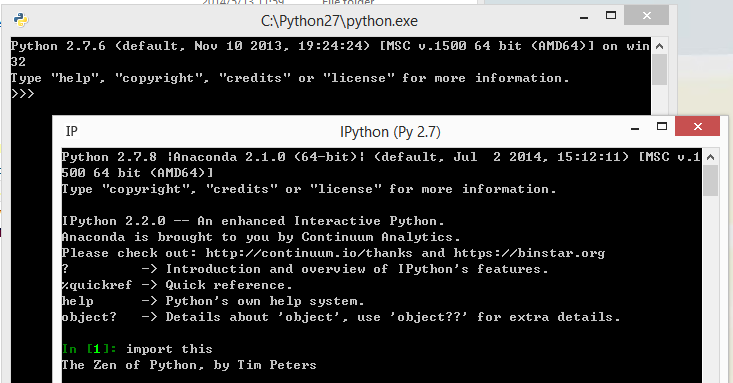
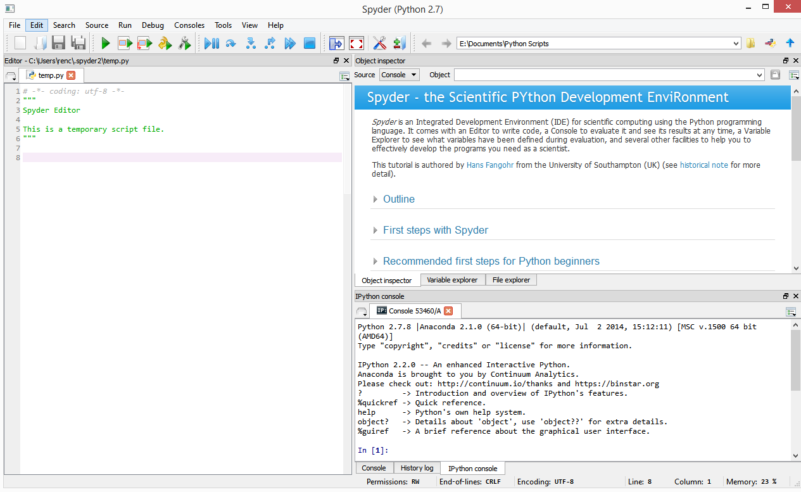

Title: Python Basis 基础笔记 
Date: 2014-08-21 10:20
Modified: 2014-08-21 19:30
Category: programming 
Tags: Python, 
Slug: Python Basis 基础笔记 
Authors: 

新接触python programming, 记录一些基础.        

Batteries Included. 立马就可以使用的. 
Installizaton 
----          
download 2.7 from python website and install at C:\Python27;                
download Anaconda 2.1.0 install at E:\Anaconda;                    
           
看来两者并不冲突.                    
 
这是从Anaconda里面起来的Spyder IDE:  
        

Variables and Data  
----   
A variable is a name that points to some specific data type. 不允许声明一个变量而没有=赋值. 
contents = 6;                   
print( type(contents) );       
contents = str(contents);        
print( type(contents) );           
                             
functions: y=float(x), int(), str(), unicode();         
      
import keywork;     
for kw in keywork.kwlist: print(kw);       
     
从*Python's Data Model*来看"variables are just names that point to data", 所有的data都是objects, 每一个object都具有这三者"identity, type, value".                
identity 描述的是address in memory.      
var = 5;
var = str(var); # 其实是换了不同的object, 只是沿用了var这个名字.   
验证:    
var = 5; 
print( 'int id', id(var) );     
var = str(var);             #换了type类型了. 
print( 'str id', id(var) ); #感觉python value好像c++ pointer.         
    
Python object有一个*mutability*属性(这算是python data model的一部分?). 
mutable objects: can have their values changed( mutated );       
immutable: tuples, strings, numbers.  

var = 5; 
print( 'int id', id(var) );     
var = 6;                    #换了value, 但是type还是number, immutable, 所以是新object. 
print( 'int id', id(var) );  
    
Python的data model里面还有用*reference counting* system to manage its memory.       
RC这里的一个side effect是当两个immutable variables, type and value都一样的话, 那可能是指向同一个object(内存地址).                    
v1 = 10; 
v2 = 10; 
print( 'v1 id', id(v1) ); 
print( 'v2 id', id(v2) );   
这种情况在mutable上面不会出现, 例如两个list object, type都是list一样了, value也一样的, 但是保证是两个独立的object.    
list1 = [1, 2, 3]; 
list2 = [1, 2, 3]; 
print('list1 id', id(list1));   
print('list2 id', id(list2));       
    
del()这个built-in函数, 只是标记这个variable不能被使用了, 但是那些object data还是被python的garbage collector所管理.   
v1 = 5;   
v2 = 5;   #就是上面提供亮点灵感immutable variable同指向一个object. 
del(v1); 
print(v1); #NameError  
print(v2); #还是有效.     
     
list:   
    name = [x, y, z, 1, 2, 3];                           
    if ( isinstance(name, list) ): 
        ...
    else:  
        ... 

if string == "":   
    pass          
if obj is None:   
    pass  
        
the_file = open('sketch.tex')                        
# do sth with the data in "the_file".          
the_file.close()                        
          
          
IDLE:                
-----        
help(range)             
help(isinstance)              
                        
                        
                
References: 
----      
[Python Practice Book, by Anand Chitipothu.](http://anandology.com/python-practice-book/index.html)    
book, Head First Python, 听说book不错, 适合有编程背景的人去学python.              
book, Python Cookbook, 第三版是用python3. 适合有python基础的去看.               
[PySide Tutorials](http://qt-project.org/wiki/PySide_Tutorials)                     
[A Crash Course in Python for Scientists](http://nbviewer.ipython.org/gist/rpmuller/5920182) 
