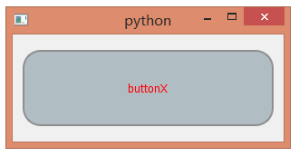

Title: build simple ui using pySide 
Date: 2014-08-25 10:20
Modified: 2014-08-25 19:30
Category: programming
Tags: 
Slug: build simple ui using pySide 
Authors: renc          

记录一下做UI prototype时候遇到的新概念 
> life is short, use python. 

早有耳闻, 一试果然不凡. 
安装Qt 4.8.X, 安装pySide (how? 具体看其主页), 然后新建file.py, 敲几行pySide代码, 然后command line里面python file.py立刻就出ui效果了. 省却了ide / c++代码 / 链接设置 / 反复修改反复编译的麻烦.    
事情的缘由是, 最近要参与用python快速做一个ui的prototype, 本来主程序M里面就有Qt+pySide, 所以连安装都不需要, 直接改py文件就得到ui结果, 真快. 于是就缺学几下python了. 

example 1. To define the style sheet 样式 of a button.    
   
```   
QPushButton {
    border: 2px solid #8f8f91;
    border-radius: 20px;
    background-color: rgb(176, 189, 194);
    color: rgb(255, 0, 0); 
    font: 10pt "MS Shell Dlg 2";
    min-width: 80px;
    min-height: 80px;  
} 
QPushButton:pressed {
    background-color: rgb(98, 105, 108);
}
```   
听说这有点像CSS的样子. 上面的定义可以在QtDesign里面不断尝试, 拖一个QPushButton到面板上, 在property panel里面找到Style Sheet属性, 里面就可以更改样式. 
code: GitHub\coding_exercises\stylesheetButton.py 

另外在QToolButton widget里面有一个autoRaise的设置, 当鼠标移动到上面时候会有凸出的效果. 
在QPushButtonse't这边要模拟的话, 可以在style sheet里面用QPushButton:hover { 自定义效果 } 

当前QPushButton按下去click之后会回弹, 假如想找个button被按下去之后保存按着的状态(例如表示选中了这个button), 可以用setDown(true/false)来达到. 
   
example 2. To enable the drag&drop of buttons.       
       
code: GitHub\coding_exercises\dragButton.py   
 
 
example 3. Signal and Slots   
three steps:            
1. define signal variable and slot function;      
2. connect the signal and slot;     
3. emit the signal, the slots will be invoked.    

一般看到的简单例子: 
```   
#!/usr/bin/env python
 
import sys
from PySide import QtCore, QtGui
 
# define a function that will be used as a slot
def sayHello():
    print 'Hello world!'
 
app = QtGui.QApplication(sys.argv)
 
button = QtGui.QPushButton('Say hello!')
 
# connect the clicked signal to the sayHello slot
button.clicked.connect(sayHello)
button.show()
 
sys.exit(app.exec_())
```   
这个QPushButton的例子里面, 其实.clicked这个QPushButton的signal已经由Qt来定义了, 而clicked这个signal的emit也由Qt完成, 所以我们只要提供Slot sayHello的定义, 已经connect就ok了. 

```
// 这些可以帮助debug  
QObject sendor();  
QString sender().objectName();  
``` 

假如一个signal连了好几个slots, 这些slots被调用的次序怎么决定的呢?            
好像是Qt 4.6之后就改成谁先连就先调用谁. 而印象中boost中的signal库是可以决定slot的调用次序的?            
http://qt-project.org/wiki/Signals_and_Slots_in_PySide

 
example 4. layout and widget 
question: layout and widget的关系 
widget->setLayout
widget->layout->addLayout/addWidget 
如此循环. 而在QLayout的doc里面说了, widget跟widget之间可能有layout, widget1.layout.addWidget(widget2), widget2的parent还是widget1, 而不是layout. layout并不会跟widget成为parent-child的关系. 

question: 清空widget 
怎么把widget里面的layout里面的children都清空(方便后面动态地生成新的widget内容)? 注意这里widget.layout本身没有变化, 例如没有从QHBoxLayout变成别的如QVBoxLayout. 而且要删除layout里面的内容(可能是子widget, 可能是子layout).   
```
// from QLayout doc,   
// The following code fragment shows a safe way to remove all items from a layout:
QLayoutItem *child;
while ((child = layout->takeAt(0)) != 0) {
    ...
    delete child;
}                
// 但是好像有说应该先if (QWidget *cW = child->widget()) delete cW; 再delete child. 其实可以自己试试, 看delete child时候会否自动跳到cW类型的deconstruction function里面.   
```  


 
 
[update 2014/8/26] ok, 有人说虽然开发容易, 但是部署难. 因为不像C++编译成binary file with dll, target machine上需要预先安装版本合适的qt & python & pySide 才能interpolate相应的.py file.   


                  
