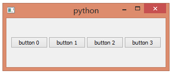

[categories] programming, 

> life is short, use python. 

早有耳闻, 一试果然不凡. 安装Qt 4.8.X, 安装pySide (how? 具体看其主页), 然后新建file.py, 敲几行pySide代码, 然后command line里面
python file.py
里面就出ui效果了. 省却了ide / c++代码 / 链接设置 / 反复修改反复编译的麻烦.    

example 1. To define the style sheet 样式 of a button.    
   
```   
                 QPushButton {
                     border: 2px solid #8f8f91;
                     border-radius: 20px;
                     background-color: rgb(176, 189, 194);
                     color: rgb(255, 0, 0); 
                     font: 10pt "MS Shell Dlg 2";
                     min-width: 80px;
                     min-height: 80px;  
                 }
                 QPushButton:pressed {
                     background-color: rgb(98, 105, 108);
                 }
```   
听说这有点像CSS的样子. 上面的定义可以在QtDesign里面不断尝试, 拖一个QPushButton到面板上, 在property panel里面找到Style Sheet属性, 里面就可以更改样式. 
code: GitHub\coding_exercises\stylesheetButton.py  
   
example 2. To enable the drag&drop of buttons.       
       
code: GitHub\coding_exercises\dragButton.py   
 


                  
