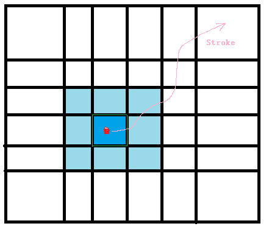

Title: Fail to surround the mouse with the vertices 
Date: 2014-09-02 16:00
Modified: 2014-09-02 16:00
Category: 
Tags: 
Slug: Fail to surround the mouse with the vertices 
Authors: renc

一个鼠标点press/click在模型上, 然后drag/move, 在这个drag的路程中, 鼠标压到的faces/edges都是连续的, 而顶点vertices竟然不是, why ?  
     
     
一个stroke的过程: mouse click/press -> drag/move -> release.    
图中红色点假如为click的起点, 然后沿着粉色的路径来drag鼠标....     

从face面的角度来看, 深蓝色的面为起点, 然后鼠标一旦离开这个深蓝色的面之后, 肯定会进入这个深蓝色面四周的8个浅蓝色面之一(假如把面的边界也看作面一部分). 于是在stroke的路线中, 鼠标所pick到的面是一个连着一个的, 连续. 

从edge边的角度来看, 鼠标从起点移动时候, 虽然鼠标在面内部而不是压在边上面, 但是面的几个边总有一个是距离当前鼠标位置近一点的, 我们选择这个边; 当鼠标移动要离开这个深蓝色的face的时候, 肯定会触碰到这个face是边(假如把角点corner也看作是edge是一部分). 于是在stroke的路线中, 鼠标所pick到的边是一个连着一个的, 也连续. 

而从顶点vertices/cornersd的角度来看呢? 如图中的stroke路线就不会压到顶点, 不会触碰到顶点, 也就是顶点, 不像之前的面和边 能保证鼠标移动的时候肯定会pick到连续的face/edge, 很可能在stroke的过程中都没有接触到几个呢, 更何况是连续?   

怎么解决, 假如我们要求stroke的路线中出现一串连续的顶点?   
因为上面说到面是完备的+连续的, 那是否可以对pick到的面求跟鼠标距离近的顶点来组成那一串连续的顶点呢.     

   
   
   

                  