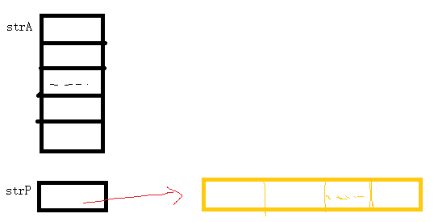

Title: Char Array vs Char Pointer 
Date: 2014-09-19 12:00
Modified: 2014-09-19 23:30
Category: programming 
Tags: 
Slug: Char Array vs Char Pointer  
Authors: 

刚才在阅读以下内容时候复习了一下这两个概念. 
[Quick case: Char Pointer vs Char Array in C++, by Bartlomiej Filipek](http://www.bfilipek.com/2014/07/quick-case-char-pointer-vs-char-array.html)  

```   
// Test case of char array vs char pointer. 
// 

#include <iostream>   

int main()     
{       
	char strA[] = "char array!";          
	char *strP = "char array?";        
	        
	std::cout << "sizeof(strA): " << sizeof(strA) << ", of: " << strA << ", addr: " << &strA << std::endl;          
	std::cout << "sizeof(strA): " << sizeof(strA) << ", of: " << &strA[0] << ", addr: " << &strA << std::endl;           
	std::cout << "sizeof(strP): " << sizeof(strP) << ", of: " << strP << ", addr: " << &strP << std::endl;            
	std::cout << "sizeof(strP): " << sizeof(strP) << ", of: " << *strP << ", addr: " << &strP << std::endl;          
	          
	strA[0] = 'C';              
	strP[0] = 'C';           
	           
	return 1;            
}       
```  
Visual Studio 2012, Debug输出为, 这是其中一个结果:   
```   
sizeof(strA): 12, of: char array!, addr: 009AFAC4           
sizeof(strA): 12, of: char array!, addr: 009AFAC4         
sizeof(strP): 4, of: char array?, addr: 009AFAB8           
sizeof(strP): 4, of: c, addr: 009AFAB8              
```    
接着就是crash:  
   

Crash的原因是strP指向的是一个ready-only memory, from [C++ FAQ]():
> A *string literal* (the formal term for a double-quoted string in C source) can be used in two slightly different ways:                   
> 1) As the initializer for an array of char, as in the declaration of char a[] , it specifies the initial values of the characters in that array (and, if necessary, its size).             
> 2) Anywhere else, it turns into an unnamed, static array of characters, and this unnamed array may be stored in read-only memory, and which therefore cannot necessarily be modified.            

我觉得底下的memory可以简单理解为:        
  
 
To read list:  
[reddit/cpp](http://www.reddit.com/r/cpp/) 上面有些cpp的信息.    
[What u should know about C++ 11, by Bartlomiej Filipek](http://www.bfilipek.com/2014/03/what-you-should-know-about-c11.html);       
[The C++14 Standard: What u Need to Know](http://www.drdobbs.com/cpp/the-c14-standard-what-you-need-to-know/240169034);  
[Smart pointers gotchas, by Bartlomiej Filipek](http://www.bfilipek.com/2013/02/smart-pointers-gotchas.html);  
[book, Effective Modern C++, by Scott Meyers, 2014](http://my.safaribooksonline.com/book/programming/cplusplus/9781491908419);  
[CppCon 2014 Speaker Materials](https://github.com/CppCon/CppCon2014) ;   
  
Multithreading for Visual Effects, book from Siggraph 2013 course note.  [Book Review from Dorian Fevrier's blog](http://www.fevrierdorian.com/blog/post/2014/08/24/Multithreading-for-Visual-Effects-book-review) 
之前有一本是Polygonal Mesh Processing, 也是源于siggraph course note.   
讲多线程的, 让我想起了[book, C++ Concurrency in Action: Practical Multithreading, by Anthony Williams] 书的评价也是很高的.    
  
[A CG nerd tale, Dorian Fevrier's blog](http://www.fevrierdorian.com/blog/);  
  
 