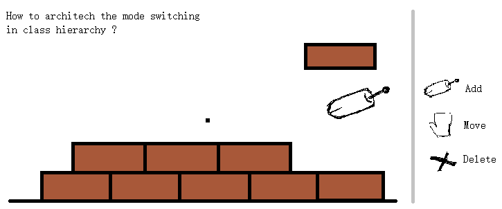
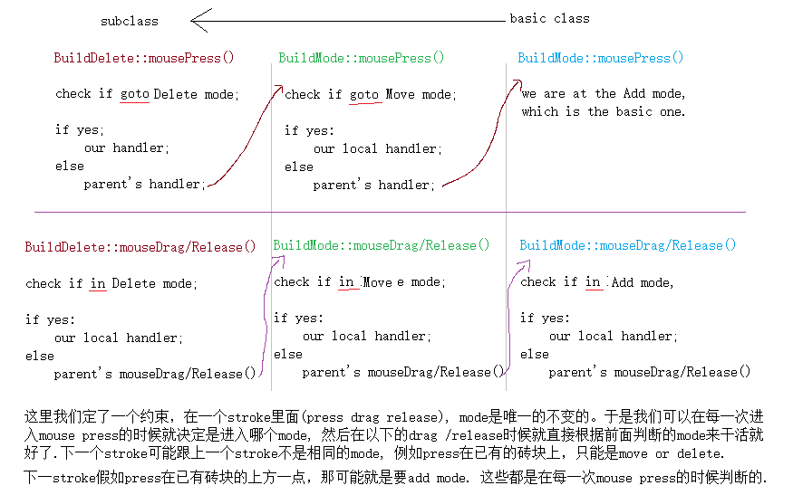

Title: Mode Switch in Class Hierarchy    
Date: 2014-09-22 18:20       
Modified: 2014-09-22 23:30       
Category: programming          
Tags:              
Slug: Mode Switch in Class Hierarchy     
Authors:           

  
想象我们正在搞一个砌砖的程序, 是的, 码农只是其中一种称呼, 时不时也被称为搬砖的.    
一开始, 我们只有不断在已有的基础上添加砖头的功能。        
后来, 我们需要有移动某些砖块的功能。例如在最外表面的砖块都可以被移动。   
再后来，我们需要敲掉某砖块的功能。                       
它们分别对应于add, move, delete这三种modes.     
   
其中一种设计方法是 
``` 
class Build 
{
    enum BuildMode {            
        Add,      
        Move,       
        Delete       
    };          
    BuildMode m_currentMode;            
};         
```     
这方法是把所有mode的实现都放在同一个地方, 每次更新都要改这个地方Build的源代码实现. 但是假如在添加move, delete这新mode的时候, 我们不想or不能改已有的只有add mode的Build源码呢?    

这是另一种设计方案  
```    
class Build  
{   
    // care about the add mode only.    
};   
class BuildMove : public Build 
{ 
    bool onMouseEvent()   
    { 
        check if we will go into the Move mode;    
        if yes, then we handle the move mode here;       
        if no, pass to the parent class Build's onMouseEvent() which handle the add mode;        
    }           
};        
class BuildDelete : public BuildMode       
{  
    bool onMouseEvent()    
    {  
        check if we will go into the Delete mode;    
        if yes, then we handle the delete mode here;       
        if no, pass to the parent class Build's onMouseEvent() which handle the add and move mode;        
    }
}; 
```    
           
每一层的class只要管好自己就ok了, 自己应付不了or不要自己应付的就pass给上层. 既能继承了上层的功能, 又能不破坏这些已有功能的基础上添加新功能. 利用了class inherit的概念.     
    
        
