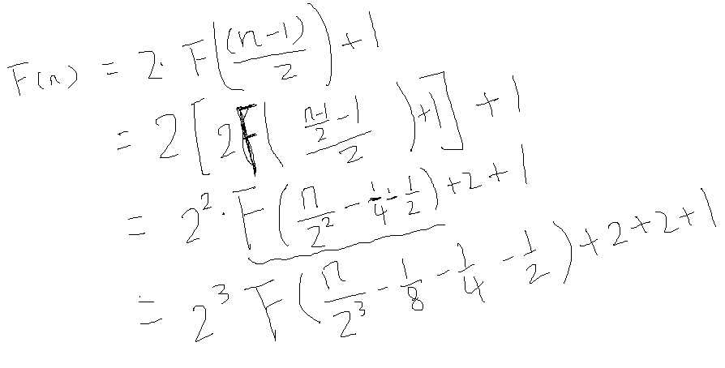

Title: Algo - Check if a binary tree is mirror or symmetric      
Date: 2014-10-11 22:00        
Modified: 2014-10-11 22:00    
Category: programming          
Tags:              
Slug: Algo - Check if a binary tree is mirror or symmetric  
Authors:             

问题: 给出一个binary tree二叉树, 判断这个数是否关于根节点对称. 

尝试在纸上画画形状, 例如:    
              
这就引入一个问题, 问题中的对称是指结构上的对称就足够了, 还是还要加上node里面的值相等呢? 
case 1: structure symmetric; 
case 2: structure symmetric + value equal; 
因为case 2是在case 1的基础上层进的, 所以并不矛盾, 先考虑case 1好了. 于是对着上面的图来写代码,  
   
```  
bool isSymmetricBinaryTree(Node *root)                    
{                                             
    // node without children                     
    if (root->left == nullptr && root->right == nullptr)        
        return true;                                                    
    //                       
    if (root->left && root->right == nullptr)                  
        return false;                                    
    if (root->left == nullptr && root->right)                
        return false;                                                  
                          
    // with both left and right children                 
    return isSymmetricNodes(root->left, root->right);             
}                                                          
bool isSymmetricNodes(Node *left, Node *right)       
{                                                
    if (left == nullptr)                                   
        return right == nullptr;                
    if (right == nullptr)              
        return left == nullptr;                 
                                     
    // neither left and right are nullptr;          
    return isSymmetricNodes(left->left, right->right) 
    && isSymmetricNodes(left->right, right->left);    
}    
```       
这代码是对着上面画图中的cases来写的, 只判断结构对称, 貌似加入value对称也容易. 在写上面的代码时候, 感觉好像直接可以简化为:   
```    
bool isSymmetricBinaryTree(Node *root)                    
{                                             
    return isSymmetricNodes(root->left, root->right);             
}     
```  
   
ok, 代码写完了, 尝试看这个算法的time complexity.                           
看时间复杂度, 书里面好像会先说明这两点:                                      
input size:  n, the node number of this binary tree.                                                 
basic operation: ==, check if two nodes are not nullptr or with the same values.                           
                                                                                   
因为这算法是recursive, F(n) = 2 * F( (n-1)/2 ) + 1; F(1) = 1;                                     
                                      
感觉不是很对啊.                                                                                                                      
递归算法的复杂度分析参考:[Introduction to the Design and Analysis of Algorithms, Third Edition, Anany Levitin 影印版];                           