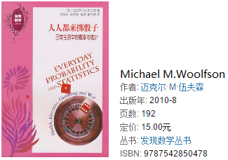

Title: Book - Everyday Probability and Statistics     
Date: 2014-10-13 22:20       
Modified: 2014-10-13 22:30       
Category:            
Tags: reading,               
Slug: Book - Everyday Probability and Statistics     
 
            
那本[Naked Statistics]是流行书, 所以年初的时候买来看, 主要是讲日常生活中, 例如媒体, 那些统计学方面的概念可能会被误解or有意无意的用来误导大众.                
也正是在看这书时候发现后几章的概念不懂, 想找本简单的书来学习一下, 于是就有了第二本[人人都来掷骰子], 跟前一本的区别是: 前几章讲了一些概率的基础, 后几章讲统计学的概念。每一章介绍一个概念, 不长, 可以一下看完. 而且一般的步骤是例子|概念|怎么算, 没有复杂的公式没有公式证明推导等. 15章后开始的样品空间, 还不是很清晰.         

不过能在上几周断断续续地看完这本书还是满足:-) 特别是还在追这部美剧:    
                    
Person of Interest / 疑犯追凶;             
这有一个问题就是我们还有多少隐私呢? 倒不是说zf监控了我们的信息, 而是我们在日常的网上购物/网上言论/网上账单等都把我们清清楚楚的记录了, 甚至比我们自己还记得清楚, 慢慢地可能比我们自己还了解我们自己了. so who care the privacy? 说真的, 我都不知道哪些属于隐私范围, 而另外即使知道了别人的隐私, 是否又等于侵犯了别人的隐私呢?                                        
 
  
  
          
                
    
