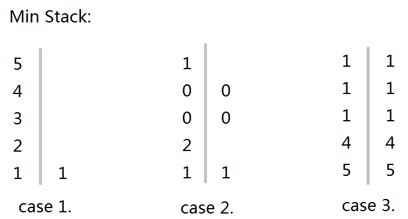

Title: LeetCodeOJ - Min Stack  
Date: 2014-12-08 20:20   
Modified: 2014-12-08 20:30    
Category: programming   
Tags: Algo,    
Slug: LeetCodeOJ - Min Stack  
Authors:    
     
Leetcode 上的题目, 实现一个Min Stack.   
+ 带stack的一般功能, push, pop, top;          
+ int getMin()能在constant time 返回最小值.                 
                                                 
很明显, 带stack一般功能的容易实现, 用std::vector也行，or直接用std::stack<>这个container adapter更直接( 所谓adapter, 就是这个类型里面的实现会用到某些简单的container, 如vector, list).                
但是那个getMin()呢?                             
假如只是取一个最小值, 那就简单了, 每次push时候都比较记录当前最小值就ok了. 但是假如不断地pop, 不断地getMin, 那stack内容改动了就需要不停地更新最小值.      

一开始我想到保存一个最小值, 并可能需要O(n)的时间来更新这个最小值.  下面的方法是保存*所有*当前的最小值. 你只要取走了最小的, 然后下一个最小的立马出现了.    
     
两个container, 其中一个是std::stack 用于实现一般的stack功能;  另一个可以是std::vector/list/stack ... 称为minStack, 用于记录收集到的最小值.            
有些很形象的特点:                          
+ minStack 总是会收集到了第一个元素;                         
+ minStack 里面的元素是递减的;                             
+ minStack 好像是一个filter, 过滤一些值大的元素;                                
+ minStack 里面的每一个元素好像都是有一定的统治范围, 在这个范围内就是它最小.     
  
   
