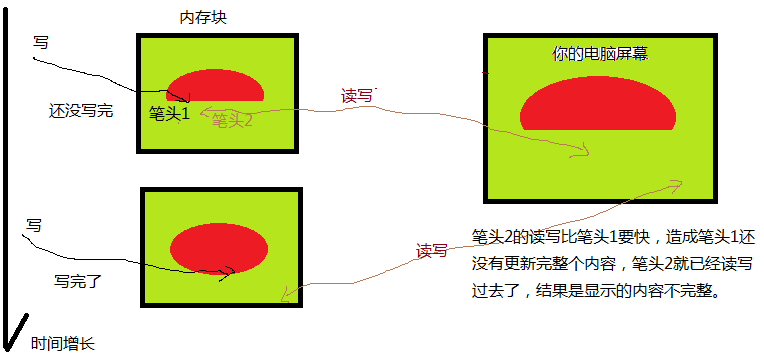
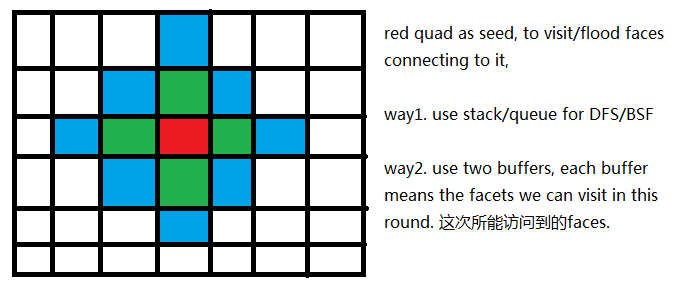

Title: GPP - Double Buffer  
Date: 2014-12-10 20:20 
Modified: 2014-12-10 20:20 
Category: programming 
Tags: 
Slug: GPP - Double Buffer  
Authors: 

首先多谢作者的慷慨generous!                                           
http://gameprogrammingpatterns.com/double-buffer.html                
                                     
Double buffer 出发点intent是使得一系列连续的操作像是同时立刻完成的。 
为什么这么说呢?                                                   
作者的例子是读写屏幕的, 我画图说明:          
     
问题是那个内存块还没有写完, 屏幕过来读的太快了, 我甚至猜想: 屏幕过来好几个笔头分任务读, 每个读一小块区域, 那速度就更快了, 快的结果是读到还没有来得及写的区域, 那可能那块区域里面就是一些不是这一帧原本想要呈现的信息(可能是之前的帧的遗留信息). 描述这样的现象专门有一个名词"tearing", or "image tearing".      
                                   
解决方案，就是引入两个buffer, 你笔头2只能从我写完的那个bufferA里面读, 而另一个bufferB我笔头1在写, 没有写完之前不给笔头2来读. 等我笔头1写完了这个bufferB, 就做一个swap告诉笔头2可以来读这个bufferB了.  笔头2来读bufferB的时候, 我笔头1又过去写bufferA了, 依然没写完之前不给笔头2来读.....          
             
[update 2014-12-18]在看以下新闻时候遇到了"image tearing"这个词. "A 4K monitor is great in theory, but extra pixels won’t really improve gaming if the screen can’t keep up with the computer’s graphics card. LCD monitors often have fixed refresh rates of either 60 or 120 Hz, but games rarely deliver frames at a constant speed, causing image tearing. The 28-inch Acer XB280HK is the first 4K monitor to include a Nvidia G-Sync board, which allows it to match rates on the fly with the computer’s graphics card. This way, dramatic battle scenes will always look the way developers intended. $799 Acer" 这里提到一个现象是GPU写的速度跟显示屏来读的速度不一致导致image tearing. 我不理解的是它指假如两者速度一致的话就不需要double buffer来解决image tearing问题里面? 还是暗示就算用了double buffer技术还是需要这种速度同步来解决image tearing问题? 当然里面的实现可以很多tricky的东西, 例如就算两者速度一样 读写的次数一样每秒 用一个buffer呢, 还是用两个buffer呢, 你来读的时刻跟我刚写完的时刻是否一致呢, 是在buffer上直接读呢 还是读之前先整块拷贝回去再慢慢读呢...          
                                                            
                               
别的应用场景(等待在日常coding中发掘啦). 这是一个例子,                   
     
在枚举邻接面的时候, 不断交换两个buffer, 每一个buffer里面表示当前这一个round所能枚举到的面, 每一个round/buffer里面的面到初始那个红色面seed的距离(步长)可以看作相同(假如从一个面到邻面的距离看作相同的话)? 挺有意思.    
                      
                     
                                                 
 
