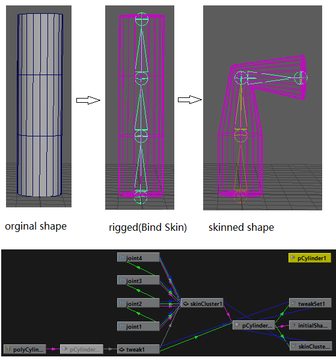
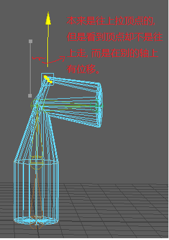
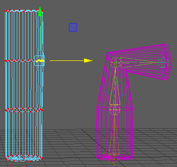
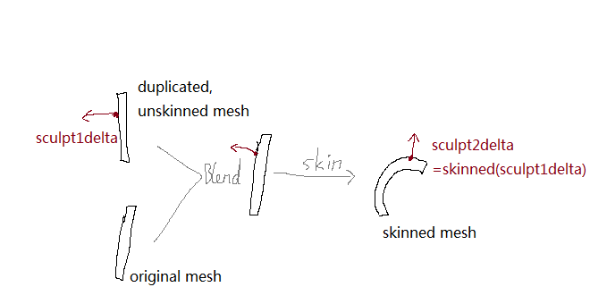
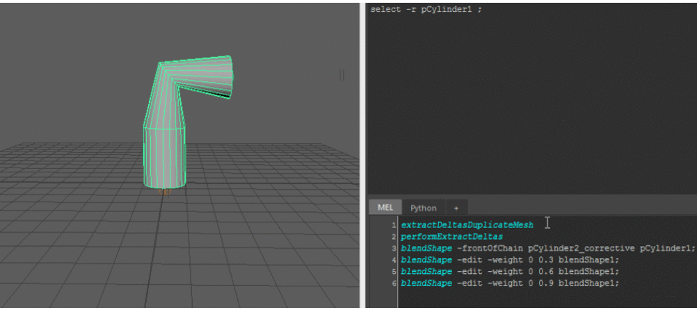

Title: Corrective Blendshape at Maya    
Date: 2014-12-20 20:20                   
Modified: 2014-12-20 20:20           
Category: programming              
Tags: maya,                                   
Slug: Corrective Blendshape at Maya     
Authors: renc            
  
记录一下最近学到的corrective blendshape知识.    
     
问题描述     
----               
First, a basic scene is built, pCylinder1 is rigged and skinned,       
     
                                 
Now, suppose we are not satisfied with the elbow shape, want it change it a little bit. 例如一个手臂的骨骼动画已经搞好了, 后面发现在形状上还想改进一下, 那怎么办呢? 
             
If we select vertices and move them (adding vector delta to these vertics) on the skinned mesh directly, the result is not expected, since the vector delta will be deformed by the skin deformer too.    
                               
                
There are some methods can be used to fix this issues, corrective blendshape就是我看到的其中一种方法.     
              
           
Corrective Blendshape         
----     
从skinned shape复制(Copy and Paste, not Duplicate)一个shape出来, 把骨骼选中并delete掉, 这样得到的模型就是骨骼变形之前的shape, 原始的初始的形状, 这个shape作为下面我们所建的blendshape node的target shape. 为什么用初始的没有变形过的形状, 而不是用变形过的形状作为target shape呢? 我感觉是跟用front of chain的方式有关, 细节在下面.                    
Create a new blendshape node, and add it at front of the skin deform node,    
```   
// to create a blendshape node at front of skinCluster node  
blendShape -frontOfChain pCylinder2 pCylinder1;                         
blendShape -edit -weight 0 1 blendShape1;     
```          
这里pCylinder1是变形过的, pCylinder2就是我们复制出来的原始的没有变形过的.     
    
然后有意思的事情出来了, 假如编辑target shape的顶点, 后面的deformed shape也相应更新.    
  
+ target shape上我是水平拉顶点的, 结果skinned shape上的顶点却不是水平一定的. 因为skin变换在blendshape的后面, blending的结果会经过skin变换.     
+ 这个target shape我感觉就是网上被称为corrective shape的东西, 而相应地这个blendshape node应该就是传说中的corrective blendshape.            
+ target shape被移动顶点之后, skinned shape立马更新, 这估计是Dependency Graph厉害的地方之一.     
+ 有时候看到skin变形 会被做成key animation, 在不同的变形程度做key. 一下子变得好像很复杂, 其实把每一帧挺下来, 就是上面这些技术. 例如要修改某帧的pose(这个pose的意思我觉得是指某个帧时候那个deformed shape的当前形状), 那pose就是我们这里的skinned shape, 而为这个pose做一个corrective blendshape, 然后这个blendshape在这个帧下weight调成1, 别的帧调为0or[0,1]之内的值, 达到过度平滑.   
   
[update 2014-12-23]在写下上面的流程之后, 隔日回想, 主要是三个steps:     
+ step1. 从skinned mesh中复制(Copy and Paste, not Duplicate)一个没有skinned过的mesh出来;     
+ step2. 把那个没有skinned过的mesh 作为target shape, skinned mesh作为source/base mesh, 建一个blendshape node, 而且这个blendshape node以frontOfChain的方式放到skinCluster前面.        
+ step3. 雕刻那个没有skinned过的mesh, 看那个skinned mesh是相应怎么更新了.  这一步要慢慢调, 因为雕刻那个没有skinned过的mesh, 得到的顶点上的vector delta还需要经过skin变换才会体现到skinned mesh上, 所以在没有skinned过的mesh上的雕刻 并不直观等于我们真正想要的在skinned mesh上的雕刻细节.                                                              
     
                                               
上面的流程, 特别是step3真的很不直观, 于是就出来了可以改进的地方, 例如我想直接在skinned mesh上做雕刻来作出我想要的效果, 而不是需要在没有skinned过的mesh做雕刻.                       
         
         
ExtractDeltas             
----    
在网上遇到这个[Extract delta plugin](http://www.braverabbit.de/playground/?p=443).  下面是使用视频,          
    
具体就是避免上面我们说的不直观的做法, 这个plugin的流程是:   
``` 
extractDeltasDuplicateMesh 
performExtractDeltas
blendShape -frontOfChain pCylinder2_corrective pCylinder1;
blendShape -edit -weight 0 0.3 blendShape1; 
blendShape -edit -weight 0 0.6 blendShape1; 
blendShape -edit -weight 0 0.9 blendShape1; 
```  
+ 通过命令extractDeltasDuplicatedMesh, 从skinned mesh复制一个temp mesh出来, 不带骨骼的, 是变换过的形状;    
+ 在复制出来的temp mesh上做雕刻, 做成我们想要的形状.  
+ 选择skinned mesh, and temp mesh, 通过命令performExtractDeltas来创建一个corrective shape, 估计是 (temp mesh - skinned mesh) with some magic transformation;   
+ corrective shape作为target shape, skinned mesh做base shape, 建blendshape node, 以front of chain的方式放到骨骼变形skinCluster node前面;  
+ ok, 可以通过调widget看到效果是好的.      
说真的, 很感谢这个plugin的作者, 提供了[源代码](data/extractDeltas.zip)方便学习, 而且我也是第一次肯定了自己没有理解错那个"corrective shape"的意思, 因为看到这个名词, 在网上有很多说各自的用法, 但是在这之前没有看到那个文档详细明确的说"corrective shape"就是那个保存了delta的用着blendshape上的target shape, 就是一个特别用处的target shape.[update 2014-12-23] BTW, 作者主页上还有不少script/plugin.         
             
上面有一步是有点magic的, 就是那个命令performExtractDeltas是怎样实现的?    
     
cvShapeInverter  
----   
[cvShapeInverter, Chad Vernon, start from 2011](http://www.chadvernon.com/blog/resources/cvshapeinverter/),[code](https://github.com/chadmv/cvshapeinverter)   
跟上面的ExtractDeltas功能很像的, 也是从两个mesh作为输入算出一个corrective shape, 也是用于a front of chain shape.      
     
其它references:  
[Christian Breitling’s correctiveShape plug-in, 2005-2008](http://www.b-ling.com/)      
[Corrective shape extraction from the inverse transformation of a skincluster, 2011](https://circecharacterworks.wordpress.com/2011/03/26/presentation/)         
[python inside maya @googlegroups](https://www.mail-archive.com/python_inside_maya@googlegroups.com/)    
 
**      
文中的gif动画文件是在[GIFMaker.me](http://gifmaker.me/)上做出来的, intuitive, thank you.     
         