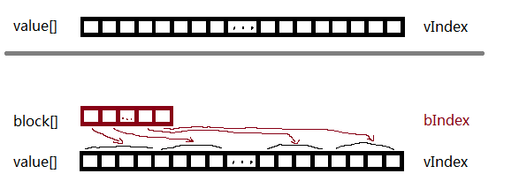

Title: 优化-访问数组值   
Date: 2014-12-31 20:20
Modified: 2014-12-31 20:30
Category: programming 
Tags:  
Slug: 优化-访问数组值   
Authors: 

记录一下学到的一个技术.      
       
假如value[]是一个很长的数组, 记录着某些对象的值, 值的范围是[0, 1]. 它的操作包括:  
给value[]初始化为每个元素都是0;   
设置某一个元素的值, 如value[vIndex] = x;  
访问某一个元素的值, 如x = value[vIndex];  
    
虽然数组很长, 很多时候一次使用到的就是其中的某一小部分的值, 例如10k大小, 某次使用到的可能就是10-1k这么小的局部.    
``` 
for (int i = 0; i < 10000; ++i)
{
    // change the value of 100 elements to [0, 1];    
}    

for (int i = 0; i < 10000; ++i)
{
    if (value[i] > 0)     
        do sth, since this value is changed. 
}    
```  
可见其实大部分的element都是没有被改动, 而这些大部分的elements都是没有必要被访问到的, 否则浪费了.   
   
学到的一个技术思路如上面我画的图. 除了本来的value[]以外, 引入额外的一个新数组block[], 大小是:   
block.size() * sizePerBlock = value.size();    
block[]中每一个元素的值true/false, 表示所对应的value[]中的一个分块block里面是否有值被更新过.    
关键问题是bIndex <> vIndex之间的映射:   
```    
// [bIndex * sizePerBlock, (bIndex+1) * sizePerBlock ) == vIndex;    
// int(vIndex / sizePerBlock) == bIndex;          
 
// to setting values. 
for (int i = 0; i < 10000; ++i)
{
    // change the value of 100 elements to [0, 1];    
    int bIndex = i / sizePerBlock; 
    block[bIndex] = true;    
    value[i] = newValue;         
}    

// to query values. 
for (int bIndex = 0; bIndex < block.size(); ++bIndex)
{
    if (block[bIndex]) 
    {
        for (int vIndex = bIndex * sizePerBlock; vIndex < (bIndex+1)*sizePerBlock; ++vIndex)   
            //(value[i]) 
    }     
}  
```    
   