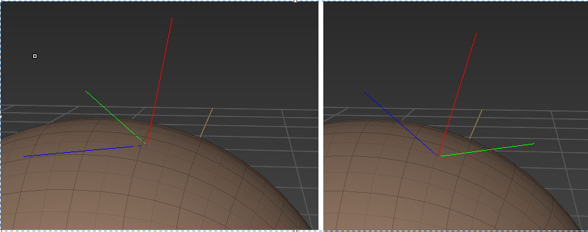
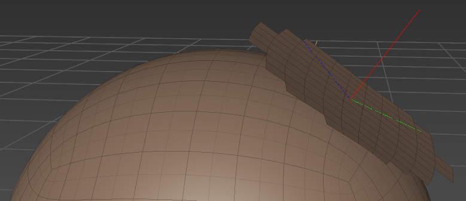

Title: Slide vertex on surface         
Date: 2015-03-04 20:20        
Modified: 2015-03-04 20:30              
Category: programming  
Tags:  
Slug: Slide vertex on surface   
Authors:    
           
过年上班没多几天啊, hackathon就开始了, 我报名的project是尝试实现以下paper:   
Sliding Deformation: Shape Preserving Per-Vertex Displacement, Dmitriy Pinskiy, EUROGRAPHICS 2010.   
本文做一些记录, 特别是有些问题以后可能也会遇到. 

想做这个slide brush的原因是: 1. 上面那个paper本身适合放到brush framework里面来做, 做成一个brush; 2. 看上去不是太难, 是有难点(后面会提到), 但是=不是那种求解方程组的优化问题(我还不太懂这个), 估计可以在2天内搞定的, yes, hackathon就2天.      
           
大体做成的效果应该是: brush stroke的时候会带动一些vertices在mesh/surface上滑动, mesh的形状shape被保持。区别于现在mudbox已有的grab brush, 后者顶点跟着鼠标在走,会跑到mesh外面. 区域   
    
算法的输入包括(不限于)下面这些:    
+ handle, which is the mouse/brush picked surface point on mesh, P0;     
+ brush ring, this brush parameter is used to enumerate the active vertices, which are reachable/inside the brush ring;  
+ drag direction when stroking, dP0;   
   
Step 1. 当brush stroke开始, handle就有了(这个handle应该可以是face上的surface point, 不单只是如paper中说的mesh vertex), 然后就可以枚举出这个handle附近会受到影响的所谓active vertices, 为每一个active vertex P建立一个Tangent space{Np, b1, b2}, 并且在这个Tangetn space of P上构建local parameterization of P.                                                                    
          
Tangent space of vertex P的:    
P点是有法相量normal的吧, 这个之间用作为Np; vertex P本身one-ring中有一些相连接的adjacent edges/vertices,  取最远的那个顶点Vx, 对向量VP = Vx - P 分解成垂直于Np的分向量b1 = VP - dotProject(VP, Np_normalized) * Np_normalized, 然后b2 = cross product( Np, b1 ); 注意normalize. 这方法算是Gram-Schmidt正交化在三维里面简化版?     
  
              		    
Local parameterization of vertex P的求法:   
Paper中对应于3.1节. 对于每一个active vertex P, 把它四周一定范围(search distance)内的顶点Q都project到P的tangent space上得到Q', 这就是local param的意思.             
首先从P点开始枚举得到四周的很多个Q. 对于具体的一个每一个Q:                   
Vector PQ = Q - P; 跟P点上的法向量Np, 定义了一个平面plane;           
1. 这个平面跟P点上的tangent space相交, 就是tangent space上从P到Q'的方向;     			 
2. 这个平面跟mesh的相交, 会得到从P到Q沿着mesh的一个路径, 这个路径是一系列直线段组成的, 路径的长度作为在tangent space上从P到Q'的距离. 这个路径就是paper上的normal curve;      
这两项对应于paper中的Upq; 这样P四周的Q都有了参数化了, 但是这些参数化点Q'只有三维坐标而没有连接关系的话, 后面就很难使用, 所以我的做法是这些P和Qs作为从原来mesh中取出来的一个patch, 然后修改这个patch上顶点坐标为参数化后的坐标, 就ok了, 即保持了原来的adjacent信息, 也方便debug visualization这个patch来看参数化是否正确.     
 
             
Step 2. 在brush stroking过程中, mouse/brush拖拽会有一个向量dP0, 是作用于handle P0上的displacement. 现在问题就来了, 这个dP0是拖拽handle的向量, 那作用于那些active vertex P上的向量dP是什么呢?       			   
这一步真的是难点, 应就是paper中3.2节的内容, 特别是那个公式(4), 不太清楚啊.     
实现的时候可以从简单的开始, 把dP = dP0;    
      
假设上面我们求出了每一个P点的dP; 考虑上falloff, dP = dP * falloff(distance from P0 to P); 可以算出P点的新坐标    
P' = P + dP;      
这个P'要在P点的local param中找出是在哪个quad face F'里面的, 算出P'对于F'的coordinate (u, v);     	  
然后用这个F'找到在原来没有被stroke改动之前的mesh上的那个face index, 用上那个(u, v)就得到在mesh上的坐标! 也就是preserve shape的特别所在．　　　　　

[Demo](data/2015-03-04_2253_hackathon_demo_slide_brush.swf)　　　　　　　　　　
[Source Code]()   　　　
			
			
			
			
			
			
      
                               
                     

