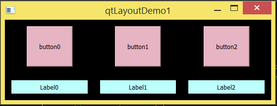
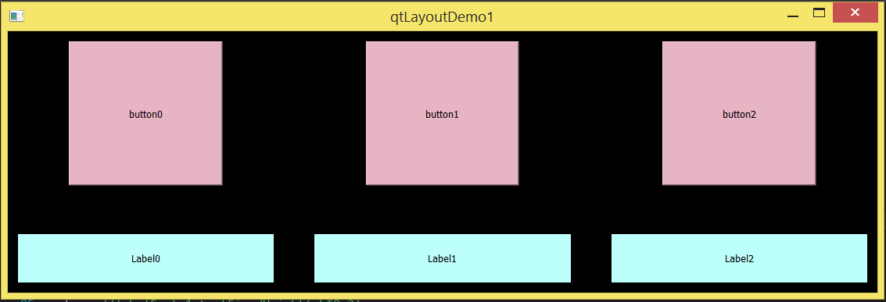

Title: QtLayoutDemo              
Date: 2016-04-19 20:20       
Modified: 2016-04-19 22:30       
Category:  
Tags:              
Slug: Qt Layout Demo                
Authors:                 
Summary:
                                        
假如要实现一下的界面：                                        
          
                                               
拖拽这个界面缩放的时候，界面里面的button, text等都随着放大缩小，中间的padding比例依旧。                                        
                                        
我一开始的做法是这个widget的layout里面加(button, label), 然后在virtual resizeEvent()里面根据widget的大小width and height, 来计算button and label的大小，然后setFixedHeight and setFixedWidth. 怎么搞都不对，虽然button and label的大小是对的，但是位置确实错的，因为中间的padding自动调节大小，莫非连中间的padding也要设置大小和位置？                                         
                                        
于是找资料，Qt GUI programming, 发现qt的界面布局可以分为三类。                                        
                                        
绝对位置法，连layout都没有用到，初始化时候除了建widgetChild以外, 只用widgetChild->setGeometry(xPos, yPos, w, h); 然后widgetFather自己setFixedSize()。                                        
这方法的问题包括，窗口大小不改变，字体的不同可能造成字体超出widget的大小，自己求每一个widgetChild的位置和大小.                                         
                                        
人工布局法，连layout都没有用到，初始化时候建widgetChild and 调用自己的setMinimumSize() and resize(), 但是widgetChild的位置大小放在widgetFather::resizeEvent()里面根据当前widgetFather大小来还是用widgetChild->setGeometry().                                        
这方法虽然还是需要自己求每一个widgetChild的位置和大小，但是这些widgetChild可以根据窗户的大小改变来改变了。                                        
                                        
布局管理器方法，layout management方法.                                         
第一步是，上下左右的次序和层次，QHBoxLayout, QVBoxLayout, QGridLayout.                                         
第二步是，大小尺寸策略 and 大小提示。                                        
大小尺寸策略：告诉布局系统怎么对它进行拉伸或者压缩。                                        
                                        
回顾我一开始的方法，其实是人工布局法(resizeEvent()) 和 布局管理器方法的混合, 结果不好。                                        
在布局管理器里面，widget加入layout里面的次序，一定程度上觉得了widgets的相对坐标了，这是我之前一直熟悉的，但是怎么达到最终的坐标呢? 这是我不知道的. 机缘下发现了setStretch()函数. setStretch(index, stretch)设置各个widget是stretch比例，就决定了widgets在layout里面的大小。更好地是，setStretch还会随着widget的拉伸而重新更新各个小widget的大小和位置来保证比例。
                      
这demo里面还有些小trick. 有些空白地方我用了addStretch(), 而有些空白地方却用了QLabel没有text, 两者的结果一样的, 用QLabel的好处是可以设置background-color, 调试时候就可以很方便地看到这个widget所占的实际空间. 而怎么使用background-code呢, 用qt design来找第一感觉, 然后参考它生成的代码。                
               					 

其它跟size有关的属性: 								 
maximumHeight, maximumWidth, maximumSize: 默认是(QWIDGETSIZE_MAX,QWIDGETSIZE_MAX), widget最大也不能超过maxi H or W.                                         
minimumHeight, minimumWidth, minimumSize: 默认是(0,0), widget最小不能小于mini H or W;   minimumSizeHint.                                         
sizeHint: .                              
setFixedHeight/setFixedWidth: 只是方便把minimum and maximum Height/Width一起设了，without changing the Hegith/Width.                                          
                                        
resize() 函数不是 virtual的, 估计不是打算给subclass override的.                                         
resizeEvent() 函数是virtual的, 可以override了.                                         
                                        
source code at .                 
                        
         